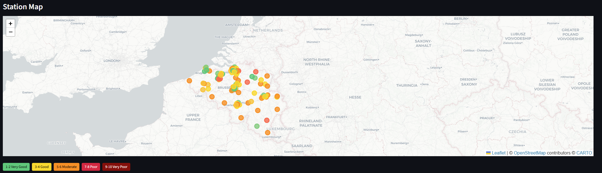
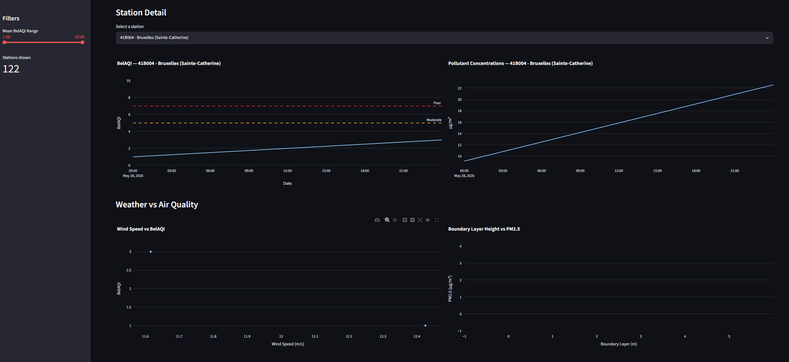
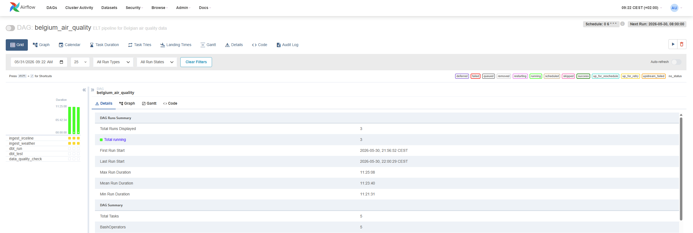

# 🇧🇪 Belgium Air Quality Pipeline

End-to-end ELT pipeline ingesting real-time and historical air quality data from Belgian monitoring stations, transforming it with dbt, validating with Great Expectations, and serving it through a FastAPI endpoint and Streamlit geospatial dashboard.

Built as a portfolio project for learning Airflow, dbt and Great Expectations

## Screenshots







## Architecture

```
IRCELINE SOS API ──┐
├──▶ Python Ingestion ──▶ Raw Parquet ──▶ dbt (DuckDB) ──▶ FastAPI / Streamlit
Open-Meteo API ────┘     (Airflow)            (local)       staging →          (serving layer)
intermediate →
marts
```

## What It Does

- **Ingests** hourly PM2.5, PM10, NO₂, and O₃ readings from 120+ Belgian monitoring stations via the IRCELINE SOS API
- **Enriches** pollution data with weather conditions (temperature, wind speed, boundary layer height) from Open-Meteo
- **Transforms** raw data through a dbt layer: cleaning, deduplication, pollutant name standardization, and weather-station joining
- **Computes** Belgium's official BelAQI index (1-10 scale) per station per day
- **Validates** data quality using dbt tests and Great Expectations (null checks, range validation, coordinate bounds, uniqueness)
- **Serves** results through a FastAPI REST API with geospatial queries (find stations within N km of any coordinate)
- **Visualizes** everything in a Streamlit dashboard with an interactive Folium map, Plotly time series, and weather correlation charts
- **Orchestrates** the full pipeline daily via an Airflow DAG running in Docker

## Tech Stack

| Layer | Tool | Purpose |
|-------|------|---------|
| Ingestion | Python, httpx | Pull from IRCELINE + Open-Meteo APIs |
| Storage | Parquet | Columnar raw storage |
| Transform | dbt (dbt-duckdb) | Staging → intermediate → mart models |
| Warehouse | DuckDB | Analytical queries |
| Data Quality | dbt tests, Great Expectations | Validation gates |
| Orchestration | Apache Airflow | Daily scheduling |
| API | FastAPI | REST endpoints with geo queries |
| Dashboard | Streamlit, Folium, Plotly | Interactive visualization |
| Infrastructure | Docker Compose | Full stack in one command |
| CI/CD | GitHub Actions | Lint + test on every push |

## Quick Start

```bash
# Clone
git clone https://github.com/KlitiHamataj/belgium-air-quality-pipeline.git
cd belgium-air-quality-pipeline

# Option 1: Run locally
python3 -m venv venv
source venv/bin/activate
pip install -r requirements.txt

python -m src.ingestion.run_all          # Pull data
cd dbt && dbt run --profiles-dir .       # Transform
dbt test --profiles-dir .                # Test
cd ..
python -m src.quality.validate           # Great Expectations
python -m uvicorn src.api.main:app       # API at :8000
streamlit run src/dashboard/app.py       # Dashboard at :8501

# Option 2: Docker (everything at once)
docker compose up --build
# Airflow UI at :8080 (admin/admin)
# API at :8000
# Dashboard at :8501
```

## API Endpoints

| Endpoint | Description |
|----------|-------------|
| `GET /health` | Pipeline status and latest data date |
| `GET /stations` | All stations with BelAQI summary stats |
| `GET /stations/{id}/daily` | Daily AQI time series for a station |
| `GET /nearby?lat=50.85&lon=4.35&radius_km=10` | Geospatial query: stations near a point |

## dbt Model Lineage

Raw Parquet
└── stg_irceline          (clean, dedupe, standardize pollutant names)
└── stg_weather            (clean, add date/hour columns)
└── int_air_quality_weather   (join AQ with nearest weather station)
└── mart_daily_aqi      (daily BelAQI per station)
└── mart_station_summary  (aggregate stats per station)

## BelAQI Index

The pipeline computes Belgium's official Air Quality Index (revised November 2022, aligned with WHO 2021 guidelines). The overall index equals the worst sub-index across PM2.5, PM10, NO₂, and O₃.

| Index | Label | PM2.5 (µg/m³) | PM10 (µg/m³) | NO₂ (µg/m³) |
|-------|-------|---------------|-------------|-------------|
| 1-2 | Very Good | 0-10 | 0-20 | 0-20 |
| 3-4 | Good | 10-25 | 20-40 | 20-50 |
| 5-6 | Moderate | 25-45 | 40-60 | 50-100 |
| 7-8 | Poor | 45-65 | 60-80 | 100-200 |
| 9-10 | Very Poor | 65+ | 80+ | 200+ |

## Project Structure

```
belgium-air-quality-pipeline/
├── dags/                          # Airflow DAG
│   └── air_quality_dag.py
├── src/
│   ├── ingestion/                 # Data extraction
│   │   ├── irceline.py            # IRCELINE SOS API client
│   │   ├── weather.py             # Open-Meteo API client
│   │   ├── config.py              # Settings from .env
│   │   └── run_all.py             # Manual runner
│   ├── api/                       # FastAPI
│   │   └── main.py
│   ├── dashboard/                 # Streamlit
│   │   └── app.py
│   └── quality/                   # Great Expectations
│       └── validate.py
├── dbt/
│   ├── models/
│   │   ├── staging/               # Clean + standardize
│   │   ├── intermediate/          # Join AQ + weather
│   │   └── marts/                 # BelAQI + summaries
│   ├── dbt_project.yml
│   └── profiles.yml
├── tests/                         # pytest unit tests
├── docker/
│   ├── Dockerfile
│   └── Dockerfile.airflow
├── .github/workflows/ci.yml       # GitHub Actions
├── docker-compose.yml
└── requirements.txt
```

## Data Sources

- **[IRCELINE](https://geo.irceline.be/sos)** — Belgium's official interregional air quality monitoring network. CC-BY-4.0 license.
- **[Open-Meteo](https://open-meteo.com/)** — Weather data API. Free, no key required.

## License

MIT